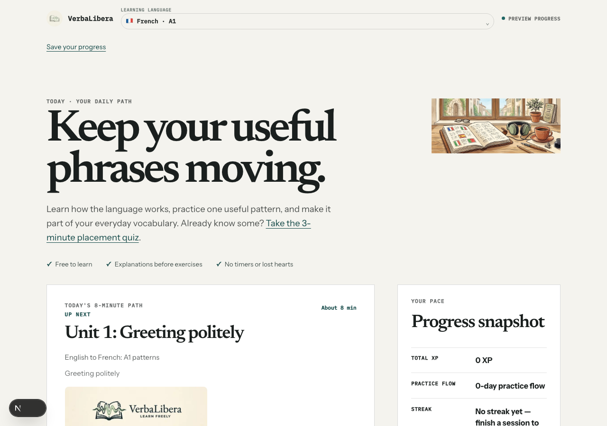
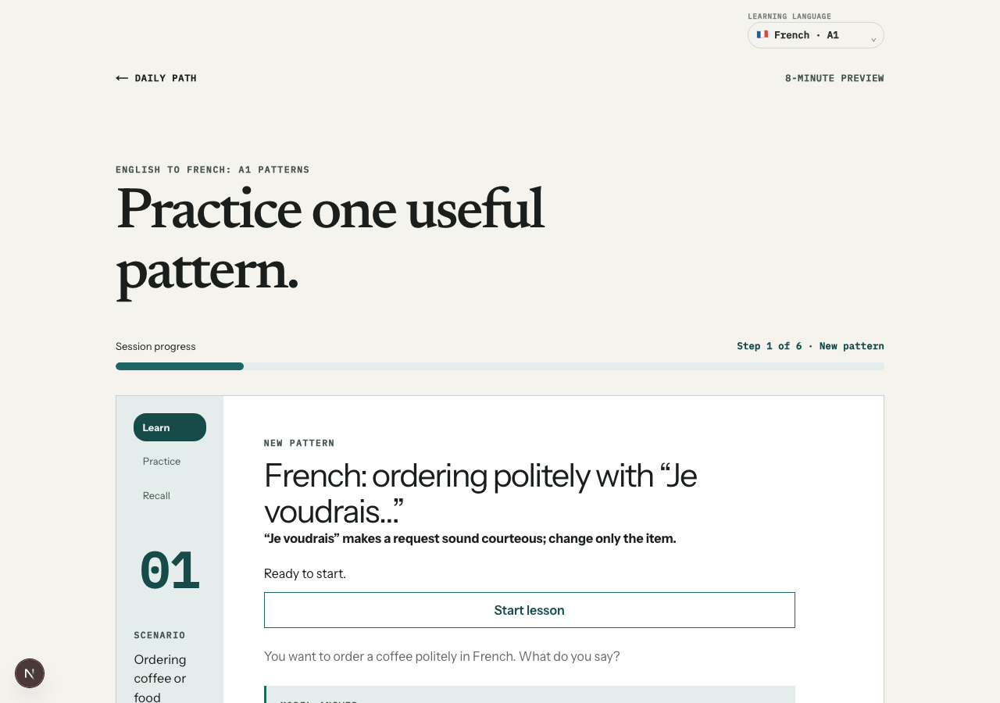
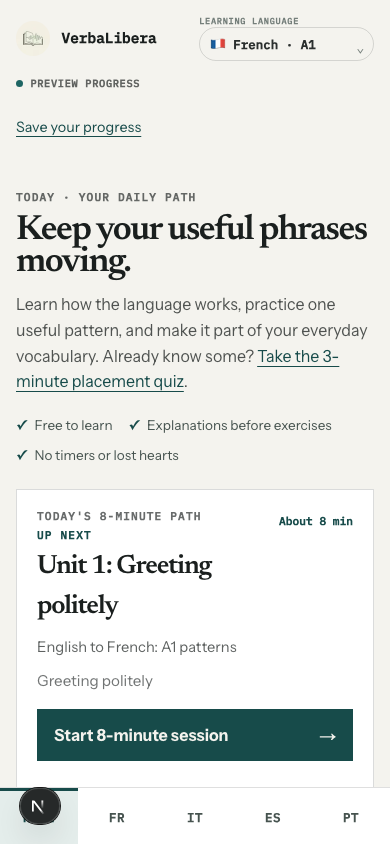
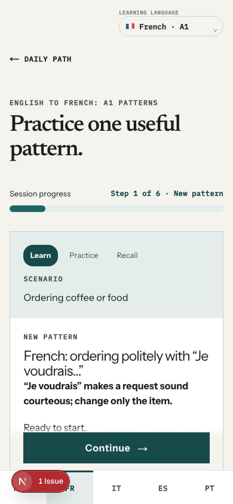

# VerbaLibera

[](https://github.com/sleuthy-sloth/VerbaLibera/actions/workflows/ci.yml)
[](LICENSE)
[](https://verbalibera.vercel.app)
[](public/sw.js)
[](docs/astra/phase-status.md)

Hosted release (may differ from this checkout): [verbalibera.vercel.app](https://verbalibera.vercel.app).

Language learning through practical sentence construction. VerbaLibera introduces a useful pattern, asks you to produce it, then lets you reveal and compare a model answer—without timers or punitive progress mechanics.

## Downloadable editions

### Portable course edition

`VerbaLibera-Portable.html` is one self-contained file for learners who want the course workspace without relying on a VerbaLibera server. Download it, keep it anywhere on your Mac, and double-click it to open in Safari or Chrome. It includes the French, German, Italian, Portuguese, and Spanish foundation packs, deterministic typed grading, review scheduling, dialogues, reference material, and every prerecorded audio file those packs use.

The portable file deliberately does not include accounts, synchronization, the dashboard, placement and study-plan persistence, travel-course pages, service-worker installation, microphone transcription, generated speech, or semantic AI grading. It makes no network request. Practice progress belongs to the browser's storage for that local file. If the browser cannot provide durable IndexedDB storage, VerbaLibera displays a persistent warning and keeps progress only until that page closes.

Use **Export practice backup** regularly, especially before moving the HTML file, clearing browser data, or changing browsers. **Import practice backup** merges that format back without double-counting event IDs. A successful save is reported only after the browser storage transaction completes.

Release downloads include `VerbaLibera-Portable.html.sha256`. Verify both files from Terminal in their download folder:

```bash
shasum -a 256 -c VerbaLibera-Portable.html.sha256
```

To build the same artifact from this checkout:

```bash
npm ci
npm run portable:build
npm run portable:verify
npm run test:e2e:portable
```

The output is written to `dist/portable/`. The Electron full-app edition is documented when its macOS package is built and verified.





The screenshots show the live app running locally with the Quiet Ink interface — a flat paper canvas, thin rules, and a single teal accent. The dashboard is mobile-first, so the narrow layout is the one most learners will see.





## Structured foundation courses

This checkout includes foundation packs for French, German, Italian, Portuguese, and Spanish. French and Italian contain the broadest curricula; German, Portuguese, and Spanish currently begin with a compact first-words foundation. French and Italian both open with a words-first lesson (greetings and Latin-shared words) before any sentence building. Each lesson teaches a pattern before asking you to use it: the lesson page shows aim, explanation, worked examples and a word list, practice opens on a zero-recall meet-the-word choice, and the lesson model autoplays when practice begins so the learner hears the pattern first. Grammar references and vocabulary views are linked to practice evidence. These are partial A1 courses, not full CEFR programs or certifications; native-speaker editorial review remains open.

Open **New: structured A1 foundations with offline study** from the Italian/French lesson index. Use **Download for offline study**, then open/bookmark the provided offline-study link. The shared offline workspace supports teaching, local grading, downloaded audio and durable device practice without a connection. Every foundation lesson now has a prerecorded model and optional dictation with slow replay. French lesson 1 also ships a 2-minute audio-only Thinking Method track (bottom **Listen** tab): an English teacher guide with think-pauses and French reveals, for walks and screen-off study — finishing a track logs it heard, never mastered. The 52 local Kokoro recordings passed waveform checks and transcription pre-screening; native-speaker prosody review remains open. Listening practice does not reset completed text lessons. The Quiet Ink interface ships original brand artwork: logo mark and lockup, hero banner, per-language course banners and a day-zero journal illustration (`public/brand/`).

Foundation practice starts in a **device-local guest store**. Select **Use signed-in account** to use a separate account store that synchronizes reviews, derived lesson completion and concept evidence across devices. Offline work uploads automatically after reconnection; sync errors leave local practice intact. Guest history is never uploaded automatically: export/import provides an explicit transfer path. Foundation and travel-course projections remain separate. The old travel courses, passkeys, Anki export, prerecorded audio and optional voice tools remain available.

The new answer evaluator uses authored variants and deterministic rules entirely in the browser. No LLM account, API key or generative runtime is required. Course JSON is separated from application code, validated during build, and fetched one language at a time. See [architecture](docs/astra/architecture.md), [curriculum](docs/astra/curriculum-system.md), [offline design](docs/astra/offline-design.md), [content tooling](docs/astra/content-pipeline.md) and [implementation report](docs/astra/implementation-report.md).

## Known rough edges (help wanted)

The foundation lessons are machine-authored and consistency-checked, but no native speaker has reviewed them yet. Expect the occasional unnatural phrasing, especially in Units 5–6. Corrections from learners and natives are the fastest way this improves: [file a content correction](https://github.com/sleuthy-sloth/VerbaLibera/issues/new?template=content-correction.yml) with the lesson, the prompt, and what it should say. Each report is checked against the lesson's teaching pattern before the data changes.

Other honest limits: partial A1 only (no B1 yet), placement is a rough starting suggestion rather than certification, and physical-iPhone testing is still open.

## Existing travel courses

The original preview path retains four A1 travel units:

- English → French
- English → Italian
- English → Spanish
- English → Portuguese

Each legacy travel course contains eight original patterns: greeting politely, ordering, finding a place, asking for help, paying, asking directions, hotel check-in, and emergency help. Every pattern follows a short `notice → build → vary → use` sequence, with sentence-construction review and controlled drills. Sessions are deliberately bounded to about eight minutes.

Every lesson now includes an authored explanation, translated sentence parts, and a worked variation before practice. Its exercises stay on the pattern just taught. All eight lessons in each language are accessible from the course index.

The dashboard and lesson pages share a Learning language dropdown. Changing it takes you directly to the same learning surface in French, Italian, Spanish, or Portuguese while keeping the current course choice visible in the URL.

Optional placement recommends a specific available starting lesson. French and Italian each have 15 questions spanning beginner and intermediate material; Spanish and Portuguese each have eight checks of the available A1 travel patterns. These are rough starting recommendations, not validated CEFR certifications. Guest results and checklists stay in the current browser; signed-in learners get placement results and study plans saved to their account (`GET/POST/DELETE /api/placement`, `/api/study-plan`) so they follow across devices.

The guided session is built around deliberate retrieval. A learner can reveal the model answer, self-check, and continue with keyboard- and touch-friendly controls. Nothing saved in preview mode represents mastery or proficiency.

## Travel-course capabilities and limits

This repo is a working preview, not a finished product.

Working:

- Four original A1 travel units (French, Italian, Spanish, Portuguese) with eight patterns each, every pattern carrying a substitution/transformation drill plus a picture-choice drill (22 CC0 photos, provenance in `docs/image-provenance.md`).
- Responsive dashboard and step-specific guided sessions, including keyboard focus continuity and mobile/desktop browser coverage.
- Model-audio playback for every authored pattern — 64 original Kokoro 0.9.4 WAVs committed with hashes and provenance (`ff_siwis` / `if_sara` / `ef_dora` / `pf_dora`), with honest text/reveal fallback when a clip is unavailable.
- Typed answer checking on drill steps with an honest three-state verdict — computed locally via the optional voice sidecar, with exact-match fallback when it is off.
- Passkey accounts (WebAuthn, no passwords) with persisted progress — `GET /api/demo/progress` is account-scoped when signed in and `POST /api/progress/review` is idempotent via `ReviewLog`.
- Truthful progress copy single-sourced in `src/lib/progress/copy.ts`: `dashboardBadgeCopy({ isPreview })` → `Preview progress` (signed-out preview) / `Saved to your account` (signed-in), `sessionCompletionCopy({ isPreview })` → `Nothing was saved.` (preview) / `Saved to your account.` (signed-in).
- Prisma/PostgreSQL schema for users, courses, concepts, drills, progress, audio segments, and expiring single-use passkey challenges.
- SM-2 sentence-construction scheduler (quality mapping keeps answer reveal from counting as mastery).
- Exact-concept access policy: a passed assessment unlocks the related drills.
- Study plans that drive the daily session: the builder writes a week-by-week checklist, `composeDailySession` derives steps from it, the dashboard shows week position and today's items, and signed-in plans persist via `/api/study-plan` with progress derived from saved retrieval.
- Placement results that follow the account: `GET/POST/DELETE /api/placement` with zod validation against course concepts, wired into the quiz with account-change detection and a guest-local fallback.
- Safe PWA shell with original generated assets and a static-only service worker. Personalized HTML and API responses are never cached; offline navigation shows a reconnect page.
- Optional local FastAPI voice sidecar using Kokoro for TTS and faster-whisper for STT.
- One-way Anki export: each lesson page has a "Take these lessons to Anki" section (56 cards per course — dialogues, recall, listening, vocab with audio and images) via AnkiConnect. Needs Anki desktop open with the AnkiConnect add-on (code 2055492159). Reviews stay in Anki; nothing syncs back.

Not working yet:

- Full audio coverage review. All clips pass the faster-whisper STT pre-screen; human listening checklists (`docs/audio-quality-checklist-*.md`) are still open.
- Offline review queuing is limited to the current signed-in session; queued work is never replayed into another session.
- Hosted voice service. The sidecar is local-only.

Privacy-wise, no learner audio is persisted by default. The voice route returns only a transcript and status; it does not store recordings or transcripts. Typed drill answers are checked locally too: they travel only to the optional local sidecar and are never stored — and when the sidecar is off, checking degrades to exact-match comparison against the authored variants.

## Accounts and data truthfulness

VerbaLibera now supports passkey accounts. Signed-out visitors see a fully honest blank slate: the dashboard badge says "Preview progress", XP is zero, there is no streak and no completed lessons, and an onboarding panel offers a first 8-minute session. No placeholder progress is ever shown. Copy is single-sourced in `src/lib/progress/copy.ts` (`dashboardBadgeCopy({ isPreview })` and `sessionCompletionCopy({ isPreview })`), wired into `DailyPathDashboard` and `GuidedSession`.

When you create a passkey (WebAuthn, no passwords) and sign in, your progress becomes account-scoped and persisted:

- `GET /api/demo/progress` derives due reviews from `UserProgress`, XP and daily activity from `ReviewLog`, and assessed course completion from `ConceptMastery`. New accounts start at zero. The next lesson advances after a successful saved production review.
- `POST /api/progress/review` applies SM-2 server-side, is idempotent via `clientMutationId`, and logs each review in `ReviewLog`.
- The UI badge then says "Saved to your account" and due counts reflect your real queue. Session completion reports how many review results were actually saved, with separate wording for queued or unsaved practice. The sentence "Checked locally. Nothing was saved." still correctly describes the answer-checking payload — it is not a claim about your saved progress.

Learner progress is visible only to that account. No third-party trackers are used.

Passkeys require the secure `https://verbalibera.vercel.app` address and a current browser with a device screen lock, fingerprint, or face unlock. If the prompt is canceled or times out, start registration again; if an account name is already taken, sign in with that passkey or choose another name. The account screen now reports those cases directly instead of using one generic failure message.

## Quick start

You need Node.js 22.13 or newer, npm, and optionally PostgreSQL 14 or newer if you want to apply migrations and run seeds.

### One-command deploy with Docker Compose (app + Postgres 16)

This is the production-like path — no manual Postgres install needed. The app image is multi-stage `node:22-alpine` and runs `prisma migrate deploy` on start.

```bash
cp .env.example .env
# Edit .env: set DATABASE_URL, AUTH_JWT_PRIVATE_KEY / AUTH_JWT_PUBLIC_KEY (or *_PATH), WEBAUTHN_RP_ID, VERBALIBERA_VOICE_SERVICE_URL
docker compose up --build
```

Open [http://localhost:3000](http://localhost:3000). Migrations run automatically via `prisma migrate deploy` in the container entrypoint; to seed demo content:

```bash
docker compose exec app npx prisma db seed
# or: docker compose exec app npm run prisma:seed
```

Optional voice sidecar (local TTS/STT, requires Python toolchain weights — not pulled in default `docker compose up`):

```bash
docker compose --profile voice up --build
# then set VERBALIBERA_VOICE_SERVICE_URL=http://voice:8000 in .env / compose.yml
```

### Local dev without Docker

```bash
npm install
cp .env.example .env
```

If you have a local database, set `DATABASE_URL` in `.env`, then:

```bash
npm run prisma:generate
npm run prisma:migrate
npm run prisma:seed
```

If you just want to run the app without a database, the preview uses fixture data and the dashboard snapshot endpoint works without `DATABASE_URL`:

```bash
npm run dev
```

Open [http://localhost:3000](http://localhost:3000).

## Running tests

```bash
npm run test          # Vitest unit and component tests
npm run test:e2e      # Chromium browser tests
npm run test:e2e:webkit # WebKit foundation UI checks (offline automation excluded)
npm run test:e2e:portable # Chromium + WebKit tests against the single local HTML file
npm run content:validate # Course contracts, graph and media hashes
npm run portable:build # Build dist/portable/VerbaLibera-Portable.html
npm run portable:verify # Audit the artifact and write/verify its SHA-256 manifest
npm run lint          # ESLint
npm run typecheck     # TypeScript, no emit
npm run build         # Next production build
```

For the optional local Python voice service, use Python 3.11 (Kokoro 0.9.4 supports Python 3.10–3.12):

```bash
cd services/voice
python3.11 -m venv .venv
.venv/bin/pip install -r requirements.txt
.venv/bin/pytest
```

## Voice sidecar

The optional voice companion runs locally and is called only through server-only Next.js routes. It does not download model weights during the default test suite. The French pilot clips are generated through its loopback-only authoring endpoint and saved as reviewed public lesson assets; browsers never call the TTS endpoint. On macOS, install `espeak-ng` with Homebrew before generating audio. See [docs/local-voice.md](docs/local-voice.md), [audio provenance](docs/audio-provenance/french-ordering-pilot.json), and the [authoring guide](docs/content-authoring.md) for how to add a new spoken pattern end-to-end.

## Status and roadmap

VerbaLibera is in active development. Next priorities are native-speaker editorial/audio review, complete A1 coverage, foundation progress synchronization, and broader listening coverage. The design and implementation plan lives in [docs/superpowers/](docs/superpowers/).

A survey of public APIs worth trialing — dictionaries, translation, graded reading — is in [docs/public-api-options.md](docs/public-api-options.md). Nothing from that survey is integrated yet.

## Deploy to Vercel (Hobby + Neon free tiers)

1. Create a free Postgres at [neon.tech](https://neon.tech) and copy the connection string.
2. Import `sleuthy-sloth/VerbaLibera` into a **personal Hobby** Vercel project (avoids team Deployment Protection walls).
3. Set env vars (Production + Preview):
   - `DATABASE_URL` — Neon connection string (add `?sslmode=require` if Neon gives it without)
   - `AUTH_JWT_PRIVATE_KEY` / `AUTH_JWT_PUBLIC_KEY` — ES256 PEM pair (see below)
   - `WEBAUTHN_RP_ID` — your domain without scheme (e.g. `verbalibera.vercel.app`)
   - `WEBAUTHN_ORIGIN` — full origin (e.g. `https://verbalibera.vercel.app`)
   - Leave `VERBALIBERA_VOICE_SERVICE_URL` unset — the app degrades honestly to the non-voice lesson path.
4. Deploy. `vercel.json` already runs `prisma migrate deploy && npm run build`; `postinstall` runs `prisma generate`.
5. Seed from your machine against prod (writes only fixture `ContentVersion`, idempotent):
   `DATABASE_URL="<prod-url>" npm run prisma:seed`

Generate the ES256 pair locally with openssl (`prime256v1` = P-256/ES256; the app imports
PKCS#8 via `jose.importPKCS8`, so convert before pasting):

```bash
openssl ecparam -genkey -name prime256v1 -noout -out private.pem
openssl pkcs8 -topk8 -nocrypt -in private.pem -out private-pkcs8.pem
openssl ec -in private.pem -pubout -out public.pem
# AUTH_JWT_PRIVATE_KEY = contents of private-pkcs8.pem
# AUTH_JWT_PUBLIC_KEY  = contents of public.pem
```

## License

Released under the [MIT License](LICENSE). The license covers the original source code and demonstration content. Third-party assets, recordings, or transcripts must be added only with compatible licensing and attribution.
