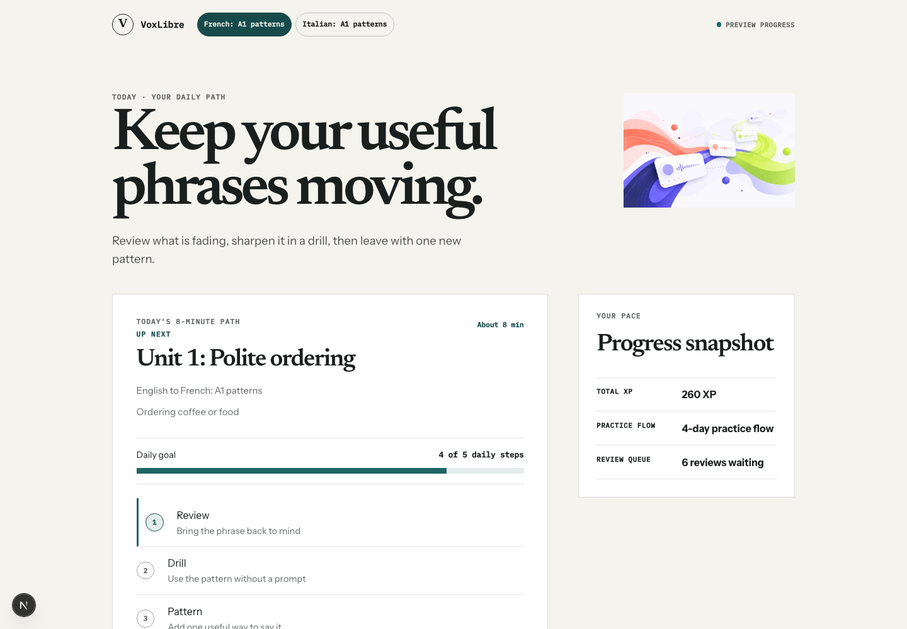
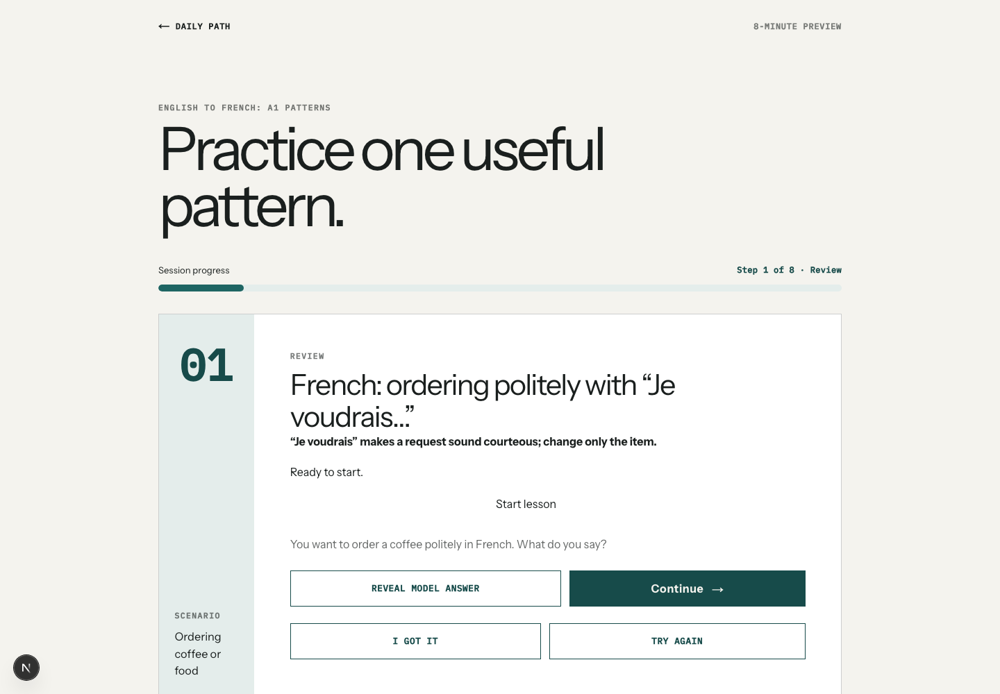
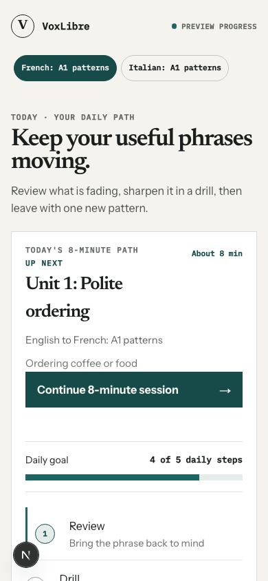
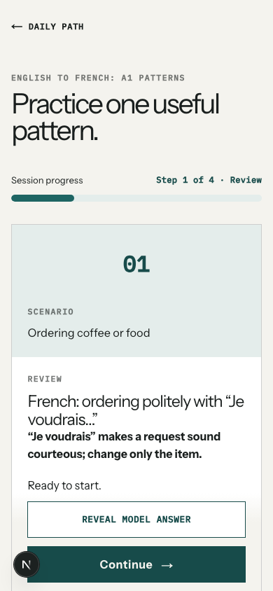

# VoxLibre

Language learning through practical sentence construction. VoxLibre introduces a useful pattern, asks you to produce it, then lets you reveal and compare a model answer—without timers or punitive progress mechanics.





The screenshots show the live app running locally with the Quiet Ink interface — a flat paper canvas, thin rules, and a single teal accent. The dashboard is mobile-first, so the narrow layout is the one most learners will see.





## What this is

VoxLibre is a preview implementation of a practical, drill-first language-learning tool. The current release has two original A1 travel units:

- English → French
- English → Italian

Each course currently contains five original travel patterns: greeting politely, ordering, finding a place, asking for help, and paying. Every pattern follows a short `notice → build → vary → use` sequence, with sentence-construction review and controlled drills. Sessions are deliberately bounded to about eight minutes.

The guided session is built around deliberate retrieval. A learner can reveal the model answer, self-check, and continue with keyboard- and touch-friendly controls. Nothing saved in preview mode represents mastery or proficiency.

## What works and what doesn't

This repo is a working preview, not a finished product.

Working:

- Two original A1 travel units with five French and five Italian patterns.
- Responsive dashboard and step-specific guided sessions, including keyboard focus continuity and mobile/desktop browser coverage.
- Optional model-audio playback with text/reveal fallback when a clip is unavailable.
- A real French polite-ordering audio pilot: two original Kokoro 0.9.4 / `ff_siwis` WAV clips, committed with hashes and provenance.
- Typed answer checking on drill steps with an honest three-state verdict — computed locally via the optional voice sidecar, with exact-match fallback when it is off.
- Passkey accounts (WebAuthn, no passwords) with persisted progress — `GET /api/demo/progress` is account-scoped when signed in and `POST /api/progress/review` is idempotent via `ReviewLog`.
- Truthful progress copy single-sourced in `src/lib/progress/copy.ts`: `dashboardBadgeCopy({ isPreview })` → `Preview progress` (signed-out preview) / `Saved to your account` (signed-in), `sessionCompletionCopy({ isPreview })` → `Nothing was saved.` (preview) / `Saved to your account.` (signed-in).
- Prisma/PostgreSQL schema for users, courses, concepts, drills, progress, and audio segments.
- SM-2 sentence-construction scheduler (quality mapping keeps answer reveal from counting as mastery).
- Exact-concept access policy: a passed assessment unlocks the related drills.
- Safe PWA shell with original generated assets and a static-only service worker.
- Optional local FastAPI voice sidecar using Kokoro for TTS and faster-whisper for STT.
- One-way Anki export: each lesson page has a "Send to Anki" section (56 cards per course — dialogues, recall, listening, vocab with audio and images) via AnkiConnect. Needs Anki desktop open with the AnkiConnect add-on (code 2055492159). Reviews stay in Anki; nothing syncs back.

Not working yet:

- Full audio coverage. Only the French polite-ordering pilot has reviewed technical assets; all remaining patterns retain an honest text-only fallback.
- Native-speaker linguistic review of the French pilot clips. The required listening checklist is intentionally still open.
- Offline sync for mutable learner data.
- Hosted voice service. The sidecar is local-only.

Privacy-wise, no learner audio is persisted by default. The voice route returns only a transcript and status; it does not store recordings or transcripts. Typed drill answers are checked locally too: they travel only to the optional local sidecar and are never stored — and when the sidecar is off, checking degrades to exact-match comparison against the authored variants.

## Accounts and data truthfulness

VoxLibre now supports passkey accounts. Signed-out visitors see a fully honest preview: the dashboard badge says "Preview progress", the session completion says "Nothing was saved.", and `GET /api/demo/progress` returns the same fixture snapshot for everyone. This preview is byte-identical to the original release. Copy is single-sourced in `src/lib/progress/copy.ts` (`dashboardBadgeCopy({ isPreview })` and `sessionCompletionCopy({ isPreview })`), wired into `DailyPathDashboard` and `GuidedSession`.

When you create a passkey (WebAuthn, no passwords) and sign in, your progress becomes account-scoped and persisted:

- `GET /api/demo/progress` then composes your `DemoProgressSnapshot` from your `UserProgress` rows, with `dueReviewCount` derived per request from `dueAt <= now`.
- `POST /api/progress/review` applies SM-2 server-side, is idempotent via `clientMutationId`, and logs each review in `ReviewLog`.
- The UI badge then says "Saved to your account" and due counts reflect your real queue. Session completion then says "Saved to your account." The sentence "Checked locally. Nothing was saved." still correctly describes the answer-checking payload — it is not a claim about your saved progress.

Learner progress is visible only to that account. No third-party trackers are used.

## Quick start

You need Node.js 20 or newer, npm, and optionally PostgreSQL 14 or newer if you want to apply migrations and run seeds.

### One-command deploy with Docker Compose (app + Postgres 16)

This is the production-like path — no manual Postgres install needed. The app image is multi-stage `node:20-alpine` and runs `prisma migrate deploy` on start.

```bash
cp .env.example .env
# Edit .env: set DATABASE_URL, AUTH_JWT_PRIVATE_KEY / AUTH_JWT_PUBLIC_KEY (or *_PATH), WEBAUTHN_RP_ID, VOXLIBRE_VOICE_SERVICE_URL
docker compose up --build
```

Open [http://localhost:3000](http://localhost:3000). Migrations run automatically via `prisma migrate deploy` in the container entrypoint; to seed demo content:

```bash
docker compose exec app npx prisma db seed
# or: docker compose exec app npm run prisma:seed
```

Optional voice sidecar (local TTS/STT, requires Python toolchain weights — not pulled in default `docker compose up`):

```bash
docker compose --profile voice up --build
# then set VOXLIBRE_VOICE_SERVICE_URL=http://voice:8000 in .env / compose.yml
```

### Local dev without Docker

```bash
npm install
cp .env.example .env
```

If you have a local database, set `DATABASE_URL` in `.env`, then:

```bash
npm run prisma:generate
npm run prisma:migrate
npm run prisma:seed
```

If you just want to run the app without a database, the preview uses fixture data and the dashboard snapshot endpoint works without `DATABASE_URL`:

```bash
npm run dev
```

Open [http://localhost:3000](http://localhost:3000).

## Running tests

```bash
npm run test          # Vitest unit and component tests
npm run test:e2e      # Playwright browser tests
npm run lint          # ESLint
npm run typecheck     # TypeScript, no emit
npm run build         # Next production build
```

For the optional local Python voice service, use Python 3.11 (Kokoro 0.9.4 supports Python 3.10–3.12):

```bash
cd services/voice
python3.11 -m venv .venv
.venv/bin/pip install -r requirements.txt
.venv/bin/pytest
```

## Voice sidecar

The optional voice companion runs locally and is called only through server-only Next.js routes. It does not download model weights during the default test suite. The French pilot clips are generated through its loopback-only authoring endpoint and saved as reviewed public lesson assets; browsers never call the TTS endpoint. On macOS, install `espeak-ng` with Homebrew before generating audio. See [docs/local-voice.md](docs/local-voice.md), [audio provenance](docs/audio-provenance/french-ordering-pilot.json), and the [authoring guide](docs/content-authoring.md) for how to add a new spoken pattern end-to-end.

## Status and roadmap

VoxLibre is in active development. Immediate next steps are native-speaker review and expansion of the audio pilot and offline lesson sync. The design and implementation plan lives in [docs/superpowers/](docs/superpowers/).

A survey of public APIs worth trialing — dictionaries, translation, graded reading — is in [docs/public-api-options.md](docs/public-api-options.md). Nothing from that survey is integrated yet.

## Deploy to Vercel (Hobby + Neon free tiers)

1. Create a free Postgres at [neon.tech](https://neon.tech) and copy the connection string.
2. Import `sleuthy-sloth/VoxLibre` into a **personal Hobby** Vercel project (avoids team Deployment Protection walls).
3. Set env vars (Production + Preview):
   - `DATABASE_URL` — Neon connection string (add `?sslmode=require` if Neon gives it without)
   - `AUTH_JWT_PRIVATE_KEY` / `AUTH_JWT_PUBLIC_KEY` — ES256 PEM pair (see below)
   - `WEBAUTHN_RP_ID` — your domain without scheme (e.g. `voxlibre.vercel.app`)
   - `WEBAUTHN_ORIGIN` — full origin (e.g. `https://voxlibre.vercel.app`)
   - Leave `VOXLIBRE_VOICE_SERVICE_URL` unset — the app degrades honestly to the non-voice lesson path.
4. Deploy. `vercel.json` already runs `prisma migrate deploy && next build`; `postinstall` runs `prisma generate`.
5. Seed from your machine against prod (writes only fixture `ContentVersion`, idempotent):
   `DATABASE_URL="<prod-url>" npm run prisma:seed`

Generate the ES256 pair locally with openssl (`prime256v1` = P-256/ES256; the app imports
PKCS#8 via `jose.importPKCS8`, so convert before pasting):

```bash
openssl ecparam -genkey -name prime256v1 -noout -out private.pem
openssl pkcs8 -topk8 -nocrypt -in private.pem -out private-pkcs8.pem
openssl ec -in private.pem -pubout -out public.pem
# AUTH_JWT_PRIVATE_KEY = contents of private-pkcs8.pem
# AUTH_JWT_PUBLIC_KEY  = contents of public.pem
```

## License

Released under the [MIT License](LICENSE). The license covers the original source code and demonstration content. Third-party assets, recordings, or transcripts must be added only with compatible licensing and attribution.
