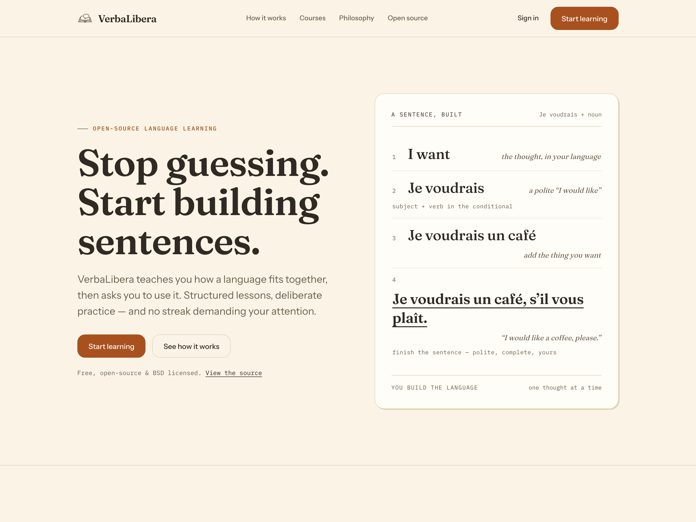
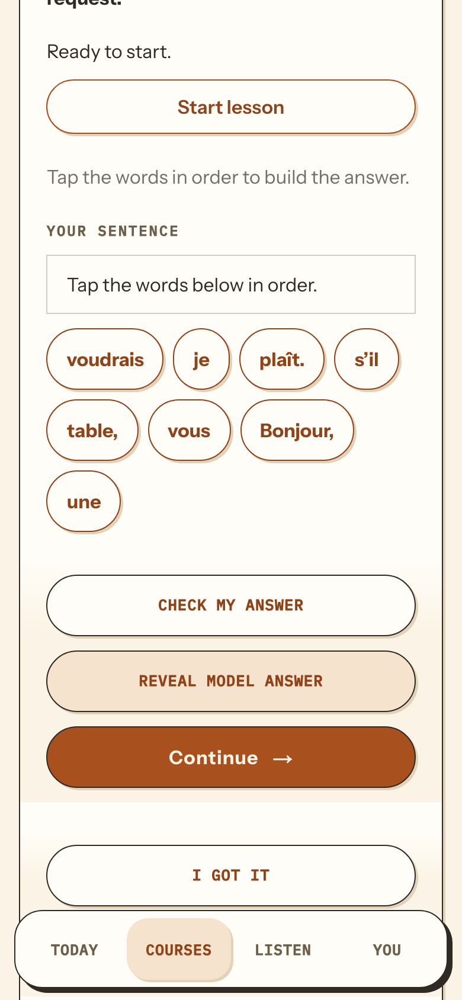
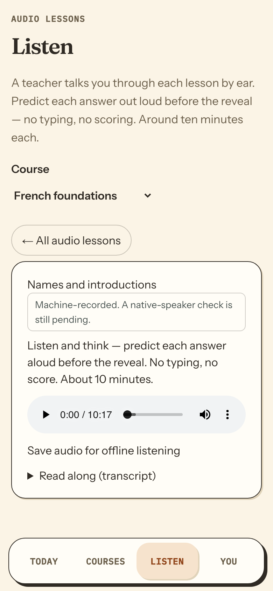
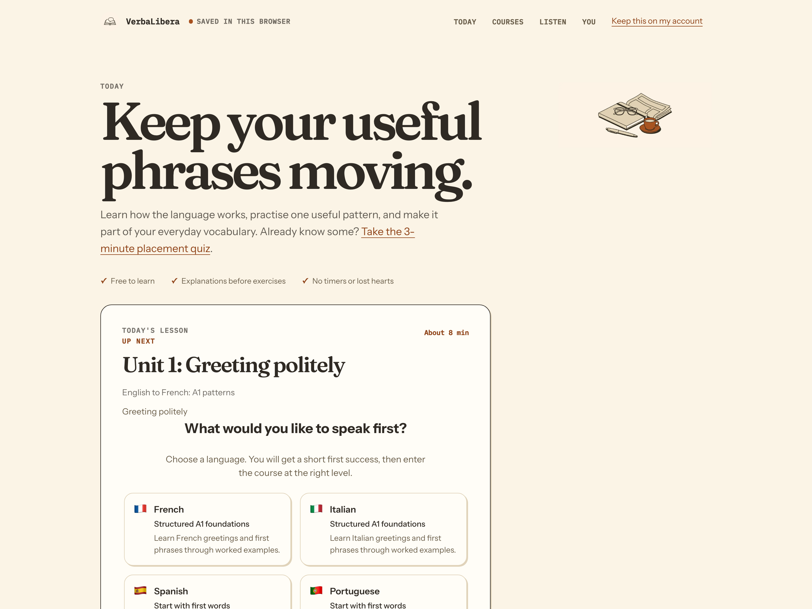

# VerbaLibera

[](https://github.com/sleuthy-sloth/VerbaLibera/actions/workflows/ci.yml)
[](https://github.com/sleuthy-sloth/VerbaLibera/releases)
[](LICENSE)
[](https://verbalibera.vercel.app)

Language learning through practical sentence construction. VerbaLibera introduces a pattern, asks you to build it yourself, then offers a model answer when you want it. No timers, no streak, no lost hearts.

Live demo: [verbalibera.vercel.app](https://verbalibera.vercel.app), offline PWA, no runtime AI.



## What this is

A free, offline-capable language app built on the [Language Transfer](https://www.languagetransfer.org/) Thinking Method: notice the pattern first, think before you answer, then use it. It covers French, German, Italian, Portuguese, and Spanish at A1.

The course workspace runs three ways:

- **Web app**: the hosted demo above, or `npm run dev` locally
- **Portable HTML**: one file you keep on a desktop and open in any browser
- **Desktop app**: unsigned Apple Silicon build with local PostgreSQL storage

None of these need an account, a server, or a connection to practise. Guest progress stays in your browser.

## Screenshots

Building a sentence from word tiles, and the audio-only path:

| Sentence building | Audio lessons |
| --- | --- |
|  |  |

The daily path, showing what is next and what needs review:



## Course structure

French and Italian have full structured A1 foundations at 25 lessons each. German, Portuguese, and Spanish run to eight lessons each, from first words through directions, prices, days and family.

Lessons open the same way, with a zero-recall word choice, and then take different routes: sentence building, changing a sentence's shape, filling a blank, reading a short passage, or listening.

### What is actually in each course

These counts are generated, not hand-maintained: `npm run content:stats` prints them and writes one report per course to `docs/astra/reports/<language>.json`. "Reachable" is the number of distinct activities a lesson's steps can put in front of you; "notice" steps are the intro explanations, which are not graded tasks. Retained v1 records are reported separately, because counting them as the course's activity total is exactly the error that used to hide the whole Italian speaking rollout.

| Course | Schema | Lessons | Practice activities | Notice steps | Speaking steps | Lessons with model audio | Audio clips | Vocabulary |
| --- | --- | ---: | ---: | ---: | ---: | ---: | ---: | ---: |
| French | v2 | 25 | 222 | 25 | 0 | 25/25 | 26 | 102 |
| Italian | v2 | 25 | 233 | 26 | 23 | 25/25 | 27 | 102 |
| German | v2 | 8 | 48 | 8 | 0 | 1/8 | 1 | 34 |
| Portuguese | v2 | 8 | 48 | 8 | 0 | 1/8 | 1 | 34 |
| Spanish | v1 | 8 | 49 | 8 | 0 | 1/8 | 1 | 34 |

74 lessons, 600 practice activities, and 23 speaking steps. Lesson count is capacity, not evidence of a CEFR level: every course is a partial A1 syllabus, and no complete A1 coverage is claimed.

The older travel-pattern courses (`english-to-french` and friends, served from the `/learn` routes) are a separate fixture from the foundation packs above and are counted separately in [docs/cefr-coverage.md](docs/cefr-coverage.md).

### Listen tracks

The **Listen** tab carries audio-only Thinking Method tracks for walks and screen-off study. Each runs 10 to 13 minutes with think-pauses and target-language reveals:

- French: Names and introductions (10:17)
- Italian: At the market (11:03)
- German: Introductions and a first café visit (12:40)
- Portuguese: Introductions and a first café visit (12:45)
- Spanish: Introductions and a first café visit (12:52)

Tracks are built locally with Kokoro TTS and can be saved as MP3s. Provenance and review notes live in `docs/audio-provenance/`.

**Where they play.** Listen is a first-class view in all three editions, not just the hosted tab:

- the hosted tab, with the course picker at `/listen`;
- the downloaded edition — save a language, go offline, open the saved entry, and pick **Listen** (`/study.html?view=listen`). The audio is part of the download: the tracks are measured into `src/features/listen/catalog.json` and cached with the pack, so they work on a plane without having been played online first. Both the course and the track need a connection once, and the download says what it costs (about 4.9-6.1 MB per course) before you press it;
- the portable single file, which is built without the audio by default — one track is ~5 MB and base64 adds a third, more than everything else in the file. `npm run portable:build -- --with-listen=french` (or `=all`) embeds it, and a file built without it says so per track instead of rendering a player that cannot load.

Listen is independent of lesson unlocks: it is a separate way into the language, and a lesson being locked must not lock its audio.

## The interface

One warm system throughout: cream stock, a single terracotta accent, Fraunces for display and Instrument Sans for text. Depth is a hard offset shadow on flat shapes, never a blur. [DESIGN.md](DESIGN.md) documents the tokens and `tests/design-tokens.test.ts` holds every stylesheet to them.

## Building from source

You need Node.js 22.13 or newer. PostgreSQL is optional.

```bash
npm install
cp .env.example .env
npm run dev          # http://localhost:3000
```

With Docker, `docker compose up --build`, then once: `docker compose run --rm app npx prisma migrate deploy`.

```bash
npm run test          # unit and component
npm run test:e2e      # Chromium
npm run test:e2e:portable
npm run content:validate
npm run lint
npm run typecheck
npm run shots         # regenerate the README screenshots (dev server running)
```

Optional local TTS and STT with Kokoro, no API keys: see [docs/local-voice.md](docs/local-voice.md).

## Accounts

Passkey accounts (WebAuthn, no passwords) are optional. Guest visitors see honest blank state, never placeholder progress. Signing in persists reviews and derived lesson completion across devices via Prisma and PostgreSQL.

Privacy: no learner audio is stored by default. The voice route returns only a transcript and discards the recording. Typed answers are checked locally in the browser.

## Known limits

- Partial A1 only. No B1 content yet. The 25-lesson French and Italian courses are a partial syllabus, not a finished A1 one.
- The exercise MIX is still lopsided and mid-repair. `translate` and typed text answers remain the most common activity in every course, and only 23 of 600 practice activities ask the learner to speak — all of them Italian. Spanish is still schemaVersion 1 and has no self-assessed exercise kind at all, so adding speaking to it is a player feature, not a content edit. French, German and Portuguese now run the schemaVersion 2 player and could carry speaking steps, but none are authored yet.
- Audio coverage is uneven in the same direction: French and Italian carry model audio in every lesson, while German, Portuguese, and Spanish have model audio in one lesson each out of eight.
- French, German and Portuguese have migrated to schemaVersion 2 (`scripts/migrate-pack-v1-v2.ts`); Spanish is the last v1 pack. Lesson, step and exercise identities, media hashes and prerequisite links are proven unchanged, and stored practice replays. The first flip dropped the authored `cefr: "A1"` lesson tags and the authored `culturalNote`s, because the v2 lesson shape had no fields for them; the schema has both now and the migration carries them, so German and Portuguese each kept all 8 of their tags and their 8 notes. French and Italian were flipped before the fields existed and still report none — re-running the migration from their v1 source would restore them, and that is a data decision, not a silent one. See [docs/cefr-coverage.md](docs/cefr-coverage.md).
- Foundation lessons are machine-authored and consistency-checked. Native-speaker review is still open, and the audio player says so.
- Placement is a rough starting suggestion, not a CEFR certification.
- Physical iPhone testing (Add to Home Screen, offline relaunch, background and foreground) is still open.
- No hosted voice service. The sidecar is local-only.
- Contrast over `color-mix()` values is not machine-verified. axe reports those nodes as undetermined, and `npm run a11y:audit` prints how many went unchecked.

If you spot an unnatural phrase or mistake, [file a content correction](https://github.com/sleuthy-sloth/VerbaLibera/issues/new?template=content-correction.yml) with the lesson, the prompt, and what it should say.

## Deploy to Vercel

1. Create a free Postgres at [neon.tech](https://neon.tech)
2. Import `sleuthy-sloth/VerbaLibera` into a personal Hobby Vercel project
3. Set `DATABASE_URL`, `AUTH_JWT_PRIVATE_KEY`, `AUTH_JWT_PUBLIC_KEY`, `WEBAUTHN_RP_ID`, `WEBAUTHN_ORIGIN`
4. Deploy. `vercel.json` handles migrations and build

Generate the ES256 key pair with `openssl ecparam -genkey -name prime256v1 -noout -out private.pem`, then `openssl pkcs8 -topk8 -nocrypt -in private.pem -out private-pkcs8.pem` and `openssl ec -in private.pem -pubout -out public.pem`.

## Status

Active development. See [docs/astra/phase-status.md](docs/astra/phase-status.md) for what is next, and [docs/superpowers/](docs/superpowers/) for the design and implementation plans.

## License

MIT. See [LICENSE](LICENSE). Third-party assets must be added only with compatible licensing and attribution.
