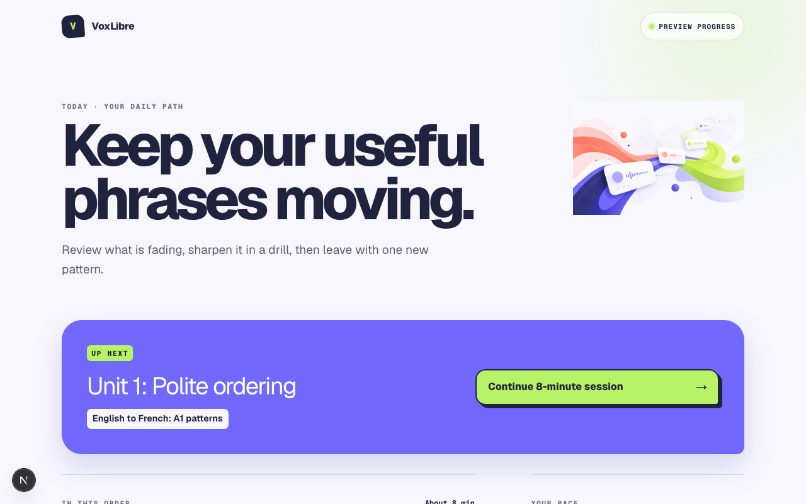
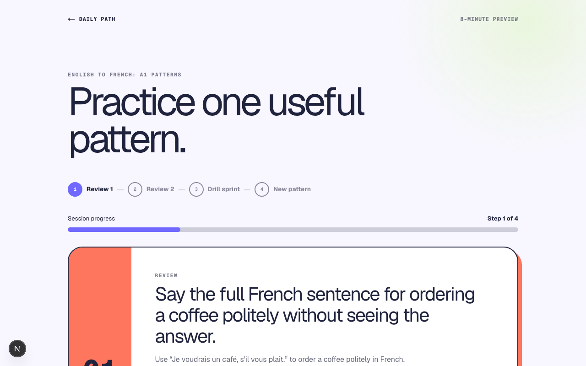
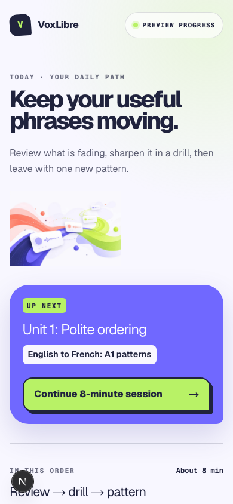
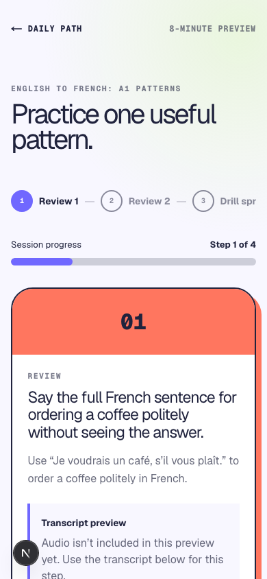

# VoxLibre

Language learning through practical sentence construction. VoxLibre introduces a useful pattern, asks you to produce it, then lets you reveal and compare a model answer—without timers or punitive progress mechanics.





The screenshots above are the live app running locally. The dashboard is mobile-first, so the narrow layout is the one most learners will see.





## What this is

VoxLibre is a preview implementation of a practical, drill-first language-learning tool. The current release has two original A1 travel units:

- English → French
- English → Italian

Each course currently contains five original travel patterns: greeting politely, ordering, finding a place, asking for help, and paying. Every pattern follows a short `notice → build → vary → use` sequence, with sentence-construction review and controlled drills. Sessions are deliberately bounded to about eight minutes.

The guided session is built around deliberate retrieval. A learner can reveal the model answer, self-check, and continue with keyboard- and touch-friendly controls. Nothing saved in preview mode represents mastery or proficiency.

## What works and what doesn't

This repo is a working preview, not a finished product.

Working:

- Two original A1 travel units with five French and five Italian patterns.
- Responsive dashboard and step-specific guided sessions, including keyboard focus continuity and mobile/desktop browser coverage.
- Optional model-audio playback with text/reveal fallback when a clip is unavailable.
- A real French polite-ordering audio pilot: two original Kokoro 0.9.4 / `ff_siwis` WAV clips, committed with hashes and provenance.
- Prisma/PostgreSQL schema for users, courses, concepts, drills, progress, and audio segments.
- SM-2 sentence-construction scheduler (quality mapping keeps answer reveal from counting as mastery).
- Exact-concept access policy: a passed assessment unlocks the related drills.
- Safe PWA shell with original generated assets and a static-only service worker.
- Optional local FastAPI voice sidecar using Kokoro for TTS and faster-whisper for STT.

Not working yet:

- Authentication. There are no accounts, so all progress is preview-only.
- Persistence mutations. SRS writes, mastery records, and progress updates are not saved.
- Full audio coverage. Only the French polite-ordering pilot has reviewed technical assets; all remaining patterns retain an honest text-only fallback.
- Native-speaker linguistic review of the French pilot clips. The required listening checklist is intentionally still open.
- Offline sync for mutable learner data.
- Hosted voice service. The sidecar is local-only.

Privacy-wise, no learner audio is persisted by default. The voice route returns only a transcript and status; it does not store recordings or transcripts.

## Quick start

You need Node.js 20 or newer, npm, and optionally PostgreSQL 14 or newer if you want to apply migrations and run seeds.

```bash
npm install
cp .env.example .env
```

If you have a local database, set `DATABASE_URL` in `.env`, then:

```bash
npm run prisma:generate
npm run prisma:migrate
npm run prisma:seed
```

If you just want to run the app without a database, the preview uses fixture data and the dashboard snapshot endpoint works without `DATABASE_URL`:

```bash
npm run dev
```

Open [http://localhost:3000](http://localhost:3000).

## Running tests

```bash
npm run test          # Vitest unit and component tests
npm run test:e2e      # Playwright browser tests
npm run lint          # ESLint
npm run typecheck     # TypeScript, no emit
npm run build         # Next production build
```

For the optional local Python voice service, use Python 3.11 (Kokoro 0.9.4 supports Python 3.10–3.12):

```bash
cd services/voice
python3.11 -m venv .venv
.venv/bin/pip install -r requirements.txt
.venv/bin/pytest
```

## Voice sidecar

The optional voice companion runs locally and is called only through server-only Next.js routes. It does not download model weights during the default test suite. The French pilot clips are generated through its loopback-only authoring endpoint and saved as reviewed public lesson assets; browsers never call the TTS endpoint. On macOS, install `espeak-ng` with Homebrew before generating audio. See [docs/local-voice.md](docs/local-voice.md), [audio provenance](docs/audio-provenance/french-ordering-pilot.json), and the [quality checklist](docs/audio-quality-checklist.md) for setup, privacy, and review details.

## Status and roadmap

VoxLibre is in active development. Immediate next steps are native-speaker review and expansion of the audio pilot, typed answer checking, authentication, persisted progress mutations, and offline lesson sync. The design and implementation plan lives in [docs/superpowers/](docs/superpowers/).

## License

Released under the [MIT License](LICENSE). The license covers the original source code and demonstration content. Third-party assets, recordings, or transcripts must be added only with compatible licensing and attribution.
